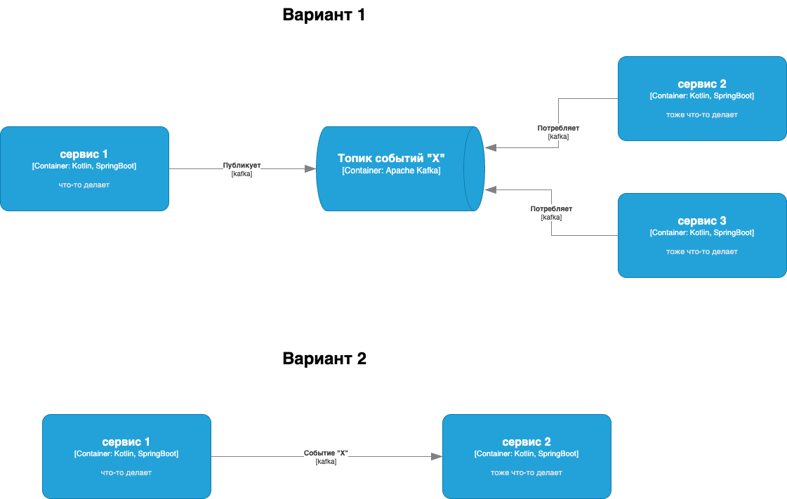

# Задание 1. Спроектируйте приложения на базе EDA

Это задание состоит из двух частей. Вам предстоит проработать различные аспекты архитектуры приложения NovaMarket, но
сначала изучите описание бизнес-сценариев, которые нужно реализовать в первую очередь.

---

## Описание сценариев

### 1. Выбор товара

Покупатель заходит на платформу, видит каталог товаров и может:

- Просматривать список доступных товаров с актуальными ценами, названием, фотографиями и кратким описанием.
- Фильтровать товары по категориям, цене и рейтингу.
- Открыть подробную карточку товара.
- Познакомиться с отзывами других покупателей.

Если покупателя заинтересовал какой-то товар, то тот добавляется в корзину, но заказ пока не оформляется.

С точки зрения бизнеса, важно, чтобы информация о товарах была точной и актуальной – особенно наличие и цена. Покупатель
принимает решение о покупке на основе этих данных, поэтому любые несоответствия (например, товар есть в каталоге, но
отсутствует на складе) снижают доверие.

---

### 2. Оформление заказа

Когда покупатель решил купить выбранные товары, он открывает корзину и начинает оформление.

#### Шаг 1. Подтвердить состав заказа

- Покупатель проверяет список товаров, их количество, цену и итоговую сумму.
- Указывает адрес доставки и выбирает способ получения (курьер, самовывоз, пункт выдачи).
- Выбирает способ оплаты.

#### Шаг 2. Проверить и зарезервировать товары

- После подтверждения заказа система проверяет, доступны ли товары в нужном количестве.
- Если всё в наличии, товар резервируется на складе, чтобы его не купил кто-то другой.

#### Шаг 3. Оплатить

- Покупатель перенаправляется на платёжную страницу, где вводит данные карты или выбирает другой способ оплаты.
- Также покупатель может привязать карту, и тогда все последующие оплаты должны осуществляться автоматически.
- Деньги либо успешно списываются, либо операция отклоняется (например, из-за недостатка средств).
- Если платёж успешен, заказ переходит в следующий этап. Если нет, он отменяется.

#### Шаг 4. Подготовить заказ к доставке

- После успешной оплаты формируется заявка на доставку, где указывается адрес, получатель и список товаров.
- Заявка отправляется в логистическую службу (внутреннюю или внешнюю).
- Продавец получает уведомление, что нужно подготовить товар к отправке.

Для бизнеса важно, чтобы оформление заказа было быстрым, удобным и прозрачным для покупателя. При этом нужно
гарантировать, что заказ будет выполнен: если покупатель оплатил товар, тот должен быть зарезервирован и доставлен.

---

### 3. Отслеживание статуса заказа

После оформления и оплаты покупатель хочет знать, что происходит с заказом.

- В личном кабинете статус заказа меняется по мере обработки: «Ожидает оплаты», «Оплачен и готовится к отправке»,
  «Передан в доставку», «Доставлен».
- Покупатель может открыть заказ и увидеть подробности: состав заказа, сумму, адрес доставки, выбранный способ доставки,
  а также предполагаемую дату получения.
- Если заказ передан в логистическую компанию, покупатель видит трек-номер и может следить за доставкой.

С точки зрения бизнеса, это важно, чтобы покупатель чувствовал контроль и уверенность, а не звонил в поддержку с
вопросом «где мой заказ?». Чем прозрачнее процесс, тем выше доверие к платформе.

Продавец тоже должен видеть статус заказов, чтобы понимать, что уже отправлено, а что ещё нужно обработать.

---

## Часть 1. Проектируем событийную архитектуру

Вам нужно спроектировать event-driven-приложение на основе описанных требований.

Составьте контейнерную (С2) диаграмму в нотации С4, на которой будет отражено:

- Какие именно микросервисы вы решили реализовать, а также их краткое описание и назначение;
- Какими событиями обмениваются ваши микросервисы.

Для отрисовки потоков событий можете использовать один из двух вариантов, показанных ниже. Однако, обратите внимание,
что не оба одновременно.

Первый вариант скорее подойдёт, если в рамках решения есть ситуации, когда несколько сервисов потребляют один и тот же
тип событий. А если таких ситуаций нет, то оптимальнее будет использовать второй вариант.

---

## Часть 2. Проектируем Saga для оформления заказа

Теперь нужно подробнее проработать реализацию сценария оформления заказа.

В его рамках на разных этапах могут случаться ошибки, например, неоплата заказа. Подобные ошибки требуют компенсационных
действий, поэтому вам предстоит спроектировать и реализовать Saga-хореографию.

Составьте реестр событий для вашей Saga-хореографии оформления заказа.

Для каждого события опишите:

- логический этап,
- тип этого события,
- его наименование.

Результат оформите в виде таблицы по примеру ниже:

| Этап                      | Тип события  | Название                     |
|---------------------------|--------------|------------------------------|
| Успешная оплата           | domain       | PaymentSucceded              |
| Ошибка активации подписки | failure      | SubscripitonActivaitonFailed |
| Возврат средств           | compensation | RefundSucceded               |

Подготовьте одну или несколько диаграмм последовательности (Sequence Diagram UML), где отразите все сценарии (как
успешные, так и ошибочные).

---

## Итоговый результат

После выполнения обоих частей задания у вас должно получиться:

- Архитектурная схема приложения (контейнерная (С2) диаграмма в нотации С4);
- Таблица-реестр событий Saga-хореографии оформления заказа;
- Диаграммы последовательности (Sequence Diagram UML) для успешных и ошибочных сценариев Saga-хореографии оформления
  заказа.

Схемы и диаграммы могут быть как в виде PlantUml, так и в виде простых картинок в формате PNG или JPG.

Таблица должна быть представлена в формате Markdown или картинкой (PNG/JPG).

Все артефакты загрузите в директорию `Task1` вашего репозитория.