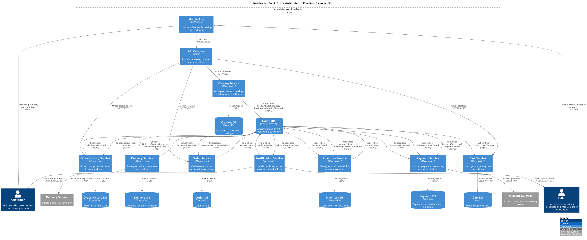

# Task 1: Event-Driven Architecture Design for NovaMarket

Это решение первого задания для проектирования микросервисной архитектуры маркетплейса NovaMarket на базе
событийно-ориентированного подхода (EDA).

## Структура решения

### 1. Архитектурная схема приложения (C2 диаграмма в нотации C4)

**Файл:** [c2-architecture.puml](diagrams/puml/c2-architecture.puml)

Контейнерная диаграмма включает:

#### Микросервисы:

- **Catalog Service** - управление каталогом товаров, ценами, отзывами и фильтрацией
- **Cart Service** - управление операциями корзины покупок
- **Order Service** - оркестрация процесса обработки заказов
- **Inventory Service** - управление наличием товаров и резервированием
- **Payment Service** - обработка платежей и привязка карт
- **Delivery Service** - управление заявками на доставку и отслеживание
- **Notification Service** - отправка уведомлений покупателям и продавцам
- **Order History Service** - хранение истории заказов и статусов

#### Ключевые компоненты:

- **Event Bus** (Kafka/RabbitMQ) - асинхронная шина событий
- **API Gateway** (NGINX) - маршрутизация запросов и аутентификация
- **Mobile App** - клиентское приложение

#### Внешние системы:

- **Payment Gateway** - внешняя платежная система
- **External Delivery Service** - внешний логистический провайдер

