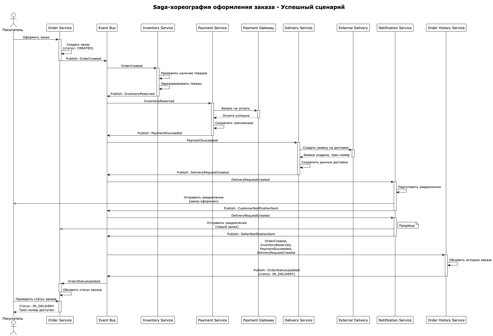
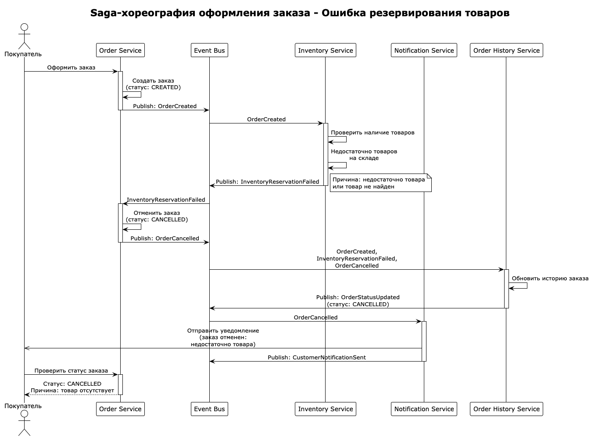
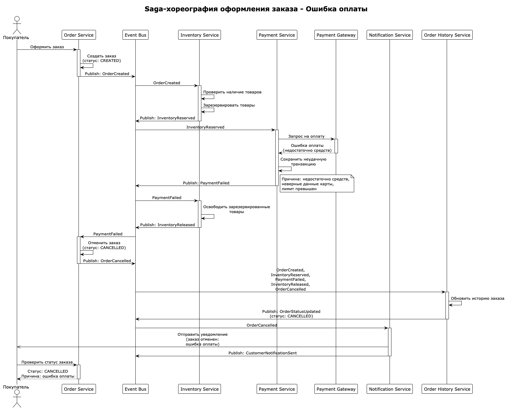
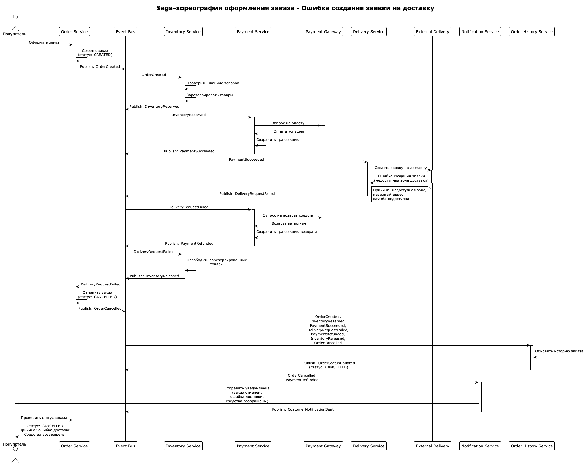

# Task 1: Event-Driven Architecture Design for NovaMarket

Это решение первого задания для проектирования микросервисной архитектуры маркетплейса NovaMarket на базе
событийно-ориентированного подхода (EDA).

## Структура решения

### 1. Архитектурная схема приложения (C2 диаграмма в нотации C4)

**Файл:** [c2-architecture.puml](diagrams/puml/c2-architecture.puml)


Контейнерная диаграмма включает:

#### Микросервисы:

- **Catalog Service** - управление каталогом товаров, ценами, отзывами и фильтрацией
- **Cart Service** - управление операциями корзины покупок
- **Order Service** - оркестрация процесса обработки заказов
- **Inventory Service** - управление наличием товаров и резервированием
- **Payment Service** - обработка платежей и привязка карт
- **Delivery Service** - управление заявками на доставку и отслеживание
- **Notification Service** - отправка уведомлений покупателям и продавцам
- **Order History Service** - хранение истории заказов и статусов

#### Ключевые компоненты:

- **Event Bus** (Kafka/RabbitMQ) - асинхронная шина событий
- **API Gateway** (NGINX) - маршрутизация запросов и аутентификация
- **Mobile App** - клиентское приложение

#### Внешние системы:

- **Payment Gateway** - внешняя платежная система
- **External Delivery Service** - внешний логистический провайдер

### 2. Реестр событий Saga-хореографии

**Файл:** [saga-events-registry.md](saga-events-registry.md)

Таблица содержит все события для Saga-хореографии оформления заказа с классификацией по типам:

- **domain** - успешные бизнес-операции
- **failure** - ошибки в процессе выполнения
- **compensation** - компенсационные действия для отката операций

### 3. Диаграммы последовательности (UML Sequence Diagrams)

#### Успешный сценарий

**Файл:** [saga-sequence-success.puml](diagrams/puml/saga-sequence-success.puml)



Полный цикл успешного оформления заказа:

1. Создание заказа
2. Резервирование товаров
3. Успешная оплата
4. Создание заявки на доставку
5. Отправка уведомлений

#### Сценарии с ошибками

**Файл:** [saga-sequence-inventory-failure.puml](diagrams/puml/saga-sequence-inventory-failure.puml)



- Ошибка резервирования товаров (недостаточно товара на складе)
- Компенсация: отмена заказа, уведомление покупателя

**Файл:** [saga-sequence-payment-failure.puml](diagrams/puml/saga-sequence-payment-failure.puml)



- Ошибка оплаты (недостаточно средств, неверные данные карты)
- Компенсация: освобождение зарезервированных товаров, отмена заказа

**Файл:** [saga-sequence-delivery-failure.puml](diagrams/puml/saga-sequence-delivery-failure.puml)



- Ошибка создания заявки на доставку (недоступная зона, неверный адрес)
- Компенсация: возврат средств, освобождение товаров, отмена заказа

## Ключевые архитектурные паттерны

Архитектура учитывает следующие паттерны, на которые сделан акцент в задании:

### 1. Event-Driven Architecture (EDA)

- Асинхронное взаимодействие через Event Bus
- Слабая связанность микросервисов
- Возможность легкого добавления новых сервисов

### 2. Saga Choreography

- Распределенная транзакция без центрального координатора
- Каждый сервис публикует события и подписывается на нужные
- Компенсационные транзакции при ошибках

### 3. Transactional Outbox Pattern

- Гарантия доставки событий (каждый сервис сохраняет события в своей БД перед публикацией)
- Атомарность бизнес-операции и публикации события

### 4. Circuit Breaker Pattern

- Защита от каскадных сбоев при обращении к внешним системам (Payment Gateway, External Delivery)
- Быстрое определение недоступности сервиса

### 5. Bulkhead Pattern

- Изоляция ресурсов между микросервисами
- Каждый сервис имеет собственную базу данных

### 6. Rate Limiter Pattern

- Защита от перегрузки на уровне API Gateway
- Контроль количества запросов от клиентов

### 7. Retry Policy Pattern

- Повторные попытки при временных сбоях
- Экспоненциальная задержка между попытками

### 8. Kubernetes Autoscaling

- **HPA (Horizontal Pod Autoscaler)** - масштабирование по метрикам CPU/Memory
- **VPA (Vertical Pod Autoscaler)** - автоматическая настройка ресурсов
- **Cluster Autoscaler** - автоматическое добавление узлов при необходимости

## Соответствие требованиям бизнеса

### MVP (через пару месяцев)

- Каталог товаров с фильтрацией
- Оформление заказа с резервированием товаров
- Интеграция с платежным шлюзом
- Интеграция со службой доставки
- Уведомления покупателям и продавцам
- История заказов

### Масштабирование (через год)

- Архитектура готова к масштабированию (40 000+ заказов в день)
- Легкое добавление новых сервисов через подписку на события
- Поддержка нескольких клиентских каналов через API Gateway
- Расширяемость для новых функций (промо-акции, возвраты, программа лояльности)

### Требования к производительности

- Синхронные операции (чтение каталога, статуса) < 300ms (98%), < 1s (99.99%)
- Асинхронная обработка заказа через события
- Немедленный ответ пользователю после создания заказа

## Диаграммы

### Генерация PNG

Для генерации изображений из PlantUML:

```bash
plantuml c2-architecture.puml
plantuml saga-sequence-*.puml
```
