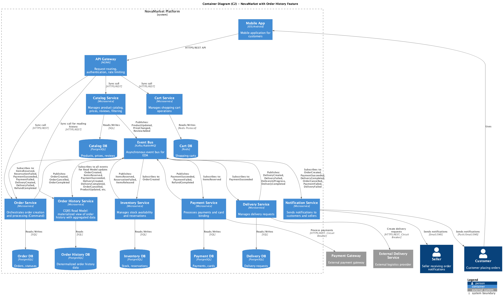

# ADR: Реализация функции просмотра истории заказов

### **Название задачи:**

Реализация функции просмотра истории заказов с агрегированными данными из нескольких микросервисов

### **Автор:**

Iaroslav L

### **Дата:**

22.02.2026

---

## **Функциональные требования**

| **№** | **Действующие лица или системы** | **Use Case**                           | **Описание**                                                                                                                                                          |
|:-----:|:---------------------------------|:---------------------------------------|:----------------------------------------------------------------------------------------------------------------------------------------------------------------------|
|   1   | Покупатель                       | Просмотр списка заказов                | Покупатель открывает личный кабинет и видит список всех своих заказов с основной информацией: дата, сумма, статус, способ доставки                                    |
|   2   | Покупатель                       | Просмотр детальной информации о заказе | Покупатель открывает конкретный заказ и видит полную информацию: список товаров с названиями, количеством и ценами, итоговую сумму, способ оплаты и доставки, статусы |
|   3   | Покупатель                       | Скачивание чека                        | Покупатель может скачать чек для завершенного заказа                                                                                                                  |
|   4   | Покупатель                       | Повторный заказ                        | Покупатель может быстро заказать те же товары снова на основе предыдущего заказа                                                                                      |
|   5   | Покупатель                       | Оставить отзыв о товаре                | Покупатель может оставить отзыв на товар из завершенного заказа                                                                                                       |

---

## **Нефункциональные требования**

| **№** | **Требование**                                                                                                                                          |
|:-----:|:--------------------------------------------------------------------------------------------------------------------------------------------------------|
|   1   | **Производительность**: Отклик на запрос истории заказов должен быть не более 300ms в 98% случаев и не более 1 секунды в 99.99% случаев                 |
|   2   | **Согласованность данных**: Данные в истории заказов должны быть согласованы с актуальными статусами в других сервисах (eventual consistency допустима) |
|   3   | **Масштабируемость**: Решение должно работать при росте до 40,000+ заказов в день                                                                       |
|   4   | **Доступность**: Просмотр истории заказов не должен зависеть от доступности всех микросервисов одновременно                                             |
|   5   | **Агрегация данных**: Необходимо объединить данные из Order Service, Catalog Service, Payment Service, Delivery Service, Inventory Service              |
|   6   | **Расширяемость**: Возможность добавления новых полей и данных из других сервисов в будущем без значительных изменений архитектуры                      |

---

## **Решение**

### Выбранное решение: **CQRS с материализованными представлениями (Materialized Views)**

Для реализации функции просмотра истории заказов с агрегированными данными принято решение использовать паттерн **CQRS (
Command Query Responsibility Segregation)** с созданием отдельного сервиса **Order History Service**, который будет
поддерживать денормализованное представление данных для быстрого чтения.

#### Архитектурное решение:

1. **Order History Service** - новый микросервис (на самом деле был заложен еще в Task1,а в этом задании был доработан),
   отвечающий за чтение истории заказов
    - Имеет собственную базу данных (Order History DB) с денормализованными данными
    - Подписывается на события от всех релевантных сервисов через Event Bus
    - Обновляет материализованные представления при получении событий (eventual consistency)
    - Предоставляет быстрый API для чтения истории заказов

2. **Разделение команд и запросов**:
    - **Command (Write) Model**: Order Service и другие сервисы отвечают за создание и изменение заказов
    - **Query (Read) Model**: Order History Service отвечает только за чтение истории с агрегированными данными

3. **Схема работы**:
    - При создании/обновлении заказа соответствующие сервисы (Order, Payment, Delivery, Inventory) публикуют события
    - Order History Service подписан на события: `OrderCreated`, `ItemsReserved`, `PaymentSucceeded`, `DeliveryCreated`,
      `DeliveryCompleted`, `OrderCancelled`, `ProductUpdated`, `PriceChanged`
    - При получении события сервис обновляет денормализованные записи в своей БД
    - Клиент запрашивает историю через API Gateway → Order History Service
    - Order History Service возвращает данные из одной таблицы/документа без JOIN-ов и вызовов других сервисов

4. **Структура данных Order History DB** (денормализованная):

```
OrderHistoryView:
  - orderId
  - customerId
  - orderDate
  - totalAmount
  - status (created, paid, in_delivery, completed, cancelled)
  - items: [
      {
        productId,
        productName,
        productImageUrl,
        quantity,
        priceAtPurchase,
        currentPrice
      }
    ]
  - payment: {
      method,
      status,
      transactionId
    }
  - delivery: {
      method,
      address,
      trackingNumber,
      estimatedDate,
      deliveryStatus
    }
```

#### Обоснование решения:

1. **Производительность**:
    - Все данные уже агрегированы и хранятся в денормализованном виде
    - Запрос требует одного SELECT без JOIN-ов
    - Нет необходимости обращаться к нескольким сервисам синхронно
    - Легко достичь требований < 300ms (98%), < 1s (99.99%)

2. **Масштабируемость**:
    - Order History Service можно масштабировать независимо от других сервисов
    - Использование индексов по customerId обеспечивает быстрый поиск
    - Можно добавить кэширование (Redis) для еще большей производительности
    - Горизонтальное масштабирование через Kubernetes HPA

3. **Отказоустойчивость**:
    - Чтение истории не зависит от доступности Order Service, Payment Service и др.
    - Если Order History Service недоступен, это не влияет на создание новых заказов
    - Circuit Breaker не нужен, так как нет синхронных вызовов других сервисов

4. **Согласованность**:
    - Eventual consistency - данные обновляются асинхронно через события
    - Для большинства use-cases задержка в несколько секунд приемлема
    - В критических случаях можно добавить индикатор "обновляется"

5. **Расширяемость**:
    - Легко добавить новые поля, подписавшись на дополнительные события
    - Новые сервисы (например, Review Service, Loyalty Service) могут публиковать события, которые обогатят историю
    - Transactional Outbox Pattern гарантирует доставку всех событий

#### Технологическая реализация:

- **База данных**: PostgreSQL с JSONB для гибкого хранения данных о товарах
- **Event Bus**: Kafka для надежной доставки событий с гарантией порядка
- **Transactional Outbox**: Каждый сервис сохраняет события в outbox-таблицу в одной транзакции с бизнес-данными
- **Event Handler**: Обработчики событий в Order History Service с идемпотентностью (event_id для дедупликации)
- **Кэширование**: Redis для кэширования часто запрашиваемых страниц истории
- **Индексы**:
    - По `customerId` для быстрого поиска заказов пользователя
    - По `orderId` для детального просмотра
    - По `orderDate` для сортировки

#### Диаграмма решения:

См. файл [c2-architecture-updated.puml](diagrams/puml/c2-architecture-updated.puml)



---

## **Альтернативы**

### Альтернатива 1: **API Composition**

**Описание**: API Gateway или специальный Aggregation Service синхронно запрашивает данные из нескольких сервисов (Order
Service, Catalog Service, Payment Service, Delivery Service) и агрегирует их на лету.

**Плюсы**:

- Простота реализации - не требуется новая БД
- Всегда актуальные данные (strong consistency)
- Не нужно синхронизировать состояние через события

**Минусы**:

- **Производительность**: Невозможно гарантировать требования < 300ms при последовательных вызовах 4-5 сервисов
- **Зависимость от доступности**: Если один из сервисов недоступен, вся история заказов недоступна
- **Сетевая задержка**: Каждый вызов добавляет latency (даже при параллельных запросах)
- **Сложность при росте**: При 40,000+ заказов в день нагрузка на все сервисы возрастет
- **Coupling**: Aggregation Service зависит от API всех других сервисов

**Когда применимо**: Подходит для MVP с небольшим количеством данных и не очень строгими требованиями к
производительности.

---

### Альтернатива 2: **Event Sourcing**

**Описание**: Все изменения заказов сохраняются как последовательность событий в Event Store. Для построения истории
заказов воспроизводятся все события для каждого заказа.

**Плюсы**:

- Полная история всех изменений заказа
- Возможность воспроизвести состояние на любой момент времени
- Audit trail "из коробки"
- Возможность создания любых проекций на основе событий

**Минусы**:

- **Сложность реализации**: Требует Event Store, механизма воспроизведения событий, snapshots
- **Производительность на чтение**: Воспроизведение событий для каждого запроса медленно (требуются snapshots)
- **Overhead**: Хранение всех событий требует больше места
- **Сложность миграции**: Изменение структуры событий сложно
- **Overkill для задачи**: Полная история изменений не требуется для просмотра заказов

**Когда применимо**: Если требуется полный audit trail, временные запросы ("покажи состояние заказа 3 дня назад"),
сложный анализ истории изменений.

---

### Альтернатива 3: **Database View в Order Service**

**Описание**: Создать материализованное представление (materialized view) в базе данных Order Service, которое join-ит
данные из нескольких таблиц.

**Плюсы**:

- Простота - используется существующая БД
- Хорошая производительность чтения

**Минусы**:

- **Нарушение Bulkhead Pattern**: Смешивание данных от разных доменов в одной БД
- **Нарушение микросервисной архитектуры**: Order Service получает доступ к данным Catalog, Payment, Delivery
- **Coupling**: Зависимость между схемами БД разных сервисов
- **Масштабирование**: Нельзя масштабировать read и write независимо

**Когда применимо**: Для монолитных приложений или небольших микросервисных систем без строгих границ доменов.

---

## **Недостатки, ограничения, риски выбранного решения**

### Недостатки и ограничения:

1. **Eventual Consistency**:
    - Данные в Order History могут быть немного устаревшими (задержка обычно < 1-2 секунды)
    - Пользователь может видеть статус "в обработке", хотя заказ уже оплачен
    - **Митигация**: Добавить индикатор "обновляется" в UI, использовать WebSockets для real-time обновлений критичных
      статусов

2. **Дублирование данных**:
    - Одни и те же данные (название товара, цена) хранятся в Catalog DB и Order History DB
    - Требуется больше места для хранения
    - **Митигация**: Денормализация - это осознанный trade-off для производительности; место хранения дешевле задержки

3. **Сложность синхронизации**:
    - Необходимо обрабатывать события от 4-5 сервисов и поддерживать консистентность
    - Риск потери события или обработки не в том порядке
    - **Митигация**: Использовать Transactional Outbox Pattern, Kafka с гарантией порядка, идемпотентные обработчики,
      event versioning

4. **Обновление исторических данных**:
    - Если в Catalog изменилось название товара, нужно решить, обновлять ли исторические записи
    - **Митигация**: Хранить как `priceAtPurchase` (не меняется), так и `currentPrice` (обновляется); для названий - не
      обновлять исторические данные

5. **Initial Load**:
    - При первом запуске Order History Service нужно загрузить существующие заказы
    - **Митигация**: Batch-процесс для начальной загрузки; в рамках MVP этого не требуется (новая система)

### Риски:

1. **Потеря событий**:
    - Риск потери события из-за сбоя Event Bus или Order History Service
    - **Митигация**: Kafka с репликацией, Transactional Outbox, retry mechanism, dead letter queue

2. **Проблемы производительности Event Processing**:
    - При 40,000 заказов в день Order History Service должен обрабатывать ~100,000+ событий в день
    - **Митигация**: Асинхронная обработка, batch updates, оптимизация обработчиков, горизонтальное масштабирование

3. **Миграция схемы Order History DB**:
    - Изменение структуры денормализованных данных сложнее, чем в нормализованной БД
    - **Митигация**: Использовать JSONB для гибкости, версионирование схемы, zero-downtime migrations

4. **Debugging и Troubleshooting**:
    - Сложнее отследить причину несоответствия данных (какое событие не пришло или обработалось неверно)
    - **Митигация**: Логирование всех полученных событий, distributed tracing (Jaeger/Zipkin), мониторинг задержки
      обработки событий

### Операционные требования:

- **Мониторинг**: Event processing lag, event delivery time, DB query performance
- **Алертинг**: Задержка обработки событий > 5 секунд, failed event processing
- **Backup**: Регулярные бэкапы Order History DB
- **Disaster Recovery**: Процесс восстановления из событий в случае потери данных

---

## **Заключение**

Выбранное решение на основе **CQRS с материализованными представлениями** оптимально соответствует требованиям задачи:

- Удовлетворяет строгим требованиям к производительности (< 300ms в 98% случаев)
- Масштабируется до 40,000+ заказов в день
- Обеспечивает высокую доступность (не зависит от других сервисов)
- Легко расширяется для добавления новых данных
- Соответствует микросервисной архитектуре и EDA
- Использует уже существующую Event Bus инфраструктуру

Trade-off в виде eventual consistency и дублирования данных является приемлемым для данного use case и значительно
перевешивается преимуществами в производительности и надежности.
