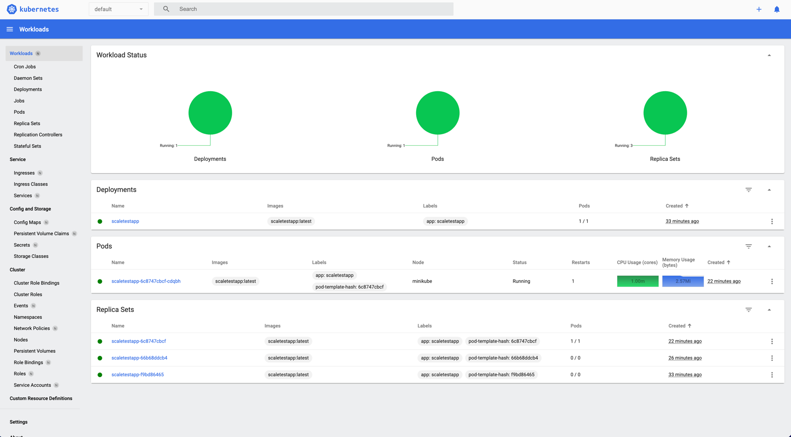
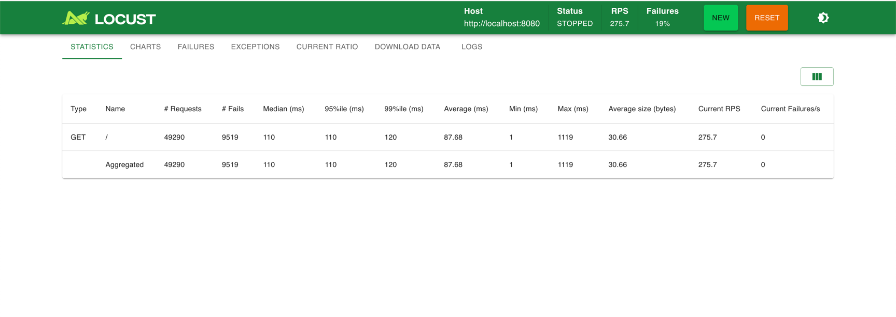
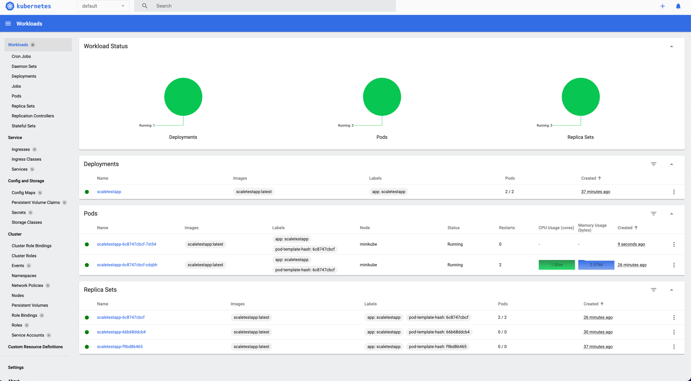

# Отчёт по заданию 3: Масштабирование приложения под нагрузку

## Цель задания

Реализовать динамическое масштабирование сервисов на основе утилизации памяти с помощью Horizontal Pod Autoscaler (HPA)
для обработки пиковых нагрузок без постоянного избыточного выделения ресурсов.

## Выполненные шаги

### 1. Запуск Minikube и активация metrics-server

```bash
# Запуск Minikube
minikube start --driver=docker

# Проверка статуса
minikube status
```

**Результат:**

```
minikube
type: Control Plane
host: Running
kubelet: Running
apiserver: Running
kubeconfig: Configured
```

```bash
# Активация metrics-server для сбора метрик
minikube addons enable metrics-server
```

**Результат:**

```
* The 'metrics-server' addon is enabled
```

### 2. Создание тестового приложения

Поскольку образ `ghcr.io/yandex-practicum/scaletestapp:latest` не поддерживает архитектуру ARM64 (используется на Apple
Silicon), было создано собственное тестовое приложение на Go.

**Файл: Task3/testapp/main.go**

- [main.go](../testapp/main.go)

**Сборка образа:**

```bash
# Использование Docker окружения Minikube для сборки образа локально
eval $(minikube docker-env)
docker build -t scaletestapp:latest Task3/testapp/
```

**Результат:**

```
Successfully built image scaletestapp:latest
```

### 3. Создание манифеста Deployment

**Файл: Task3/deployment.yaml**

- [deployment.yaml](../deployment.yaml)

**Применение манифеста:**

```bash
kubectl apply -f Task3/deployment.yaml
```

**Результат:**

```
deployment.apps/scaletestapp created
```

**Ключевые параметры:**

- `replicas: 1` - начальное количество реплик
- `memory limit: 30Mi` - ограничение памяти для контейнера
- `imagePullPolicy: Never` - использование локального образа

### 4. Создание манифеста Service

**Файл: Task3/service.yaml**

- [service.yaml](../service.yaml)

**Применение манифеста:**

```bash
kubectl apply -f Task3/service.yaml
```

**Результат:**

```
service/scaletestapp-service created
```

### 5. Создание манифеста HPA

**Файл: Task3/hpa.yaml**

- [hpa.yaml](../hpa.yaml)

**Применение манифеста:**

```bash
kubectl apply -f Task3/hpa.yaml
```

**Результат:**

```
horizontalpodautoscaler.autoscaling/scaletestapp-hpa created
```

**Ключевые параметры:**

- `minReplicas: 1` - минимальное количество реплик
- `maxReplicas: 10` - максимальное количество реплик
- `averageUtilization: 80` - целевой уровень утилизации памяти 80%

### 6. Проверка работоспособности HPA

```bash
kubectl get hpa
```

**Результат:**

```
NAME               REFERENCE                 TARGETS          MINPODS   MAXPODS   REPLICAS   AGE
scaletestapp-hpa   Deployment/scaletestapp   memory: 9%/80%   1         10        1          14m
```

**Статус показывает:**

- Текущая утилизация памяти: 9%
- Целевая утилизация: 80%
- Текущее количество реплик: 1
- HPA активен и успешно собирает метрики

```bash
kubectl describe hpa scaletestapp-hpa
```

**Важные выдержки из описания:**

```
Metrics:                                                  ( current / target )
  resource memory on pods  (as a percentage of request):  9% (2860Ki) / 80%
Min replicas:                                             1
Max replicas:                                             10
Deployment pods:                                          1 current / 1 desired
Conditions:
  Type            Status  Reason              Message
  ----            ------  ------              -------
  AbleToScale     True    ReadyForNewScale    recommended size matches current size
  ScalingActive   True    ValidMetricFound    the HPA was able to successfully calculate a replica count from memory resource utilization
  ScalingLimited  False   DesiredWithinRange  the desired count is within the acceptable range
```

### 7. Проверка работы приложения

```bash
kubectl get pods
```

**Результат:**

```
NAME                            READY   STATUS    RESTARTS   AGE
scaletestapp-6c8747cbcf-cdqbh   1/1     Running   0          5m
```

```bash
# Проброс порта для доступа к приложению
kubectl port-forward svc/scaletestapp-service 8080:8080 &

# Тестирование эндпоинта идентификатора пода
curl http://localhost:8080/
```

**Результат:**

```
Pod ID: scaletestapp-6c8747cbcf-cdqbh
```

```bash
# Тестирование эндпоинта метрик
curl http://localhost:8080/metrics
```

**Результат:**

```
# HELP http_requests_total The total number of HTTP requests.
# TYPE http_requests_total counter
http_requests_total 1
```

### 8. Тестирование автоматического масштабирования

#### 8.1. Проверка скейлинга вверх

**До нагрузки**


```bash
kubectl top pods
```

**Результат:**

```
NAME                            CPU(cores)   MEMORY(bytes)
scaletestapp-6c8747cbcf-cdqbh   1m           2Mi
```

**После нагрузки** (добавляется под при высоком потреблении ресурсов)





#### 8.2. Демонстрация скейлинга вниз

Для демонстрации работы HPA было выполнено ручное увеличение количества реплик:

```bash
kubectl scale deployment scaletestapp --replicas=3
```

**Результат после масштабирования:**

```bash
kubectl get pods
```

```
NAME                            READY   STATUS    RESTARTS   AGE
scaletestapp-6c8747cbcf-cdqbh   1/1     Running   0          4m7s
scaletestapp-6c8747cbcf-cjjhw   1/1     Running   0          10s
scaletestapp-6c8747cbcf-ztd98   1/1     Running   0          10s
```

```bash
kubectl get hpa
```

```
NAME               REFERENCE                 TARGETS          MINPODS   MAXPODS   REPLICAS   AGE
scaletestapp-hpa   Deployment/scaletestapp   memory: 9%/80%   1         10        3          15m
```

#### 8.3. Поведение HPA при низкой нагрузке

После увеличения количества реплик до 3, HPA обнаружил, что утилизация памяти (8-9%) значительно ниже целевого
значения (80%):

```bash
kubectl describe hpa scaletestapp-hpa
```

**Результат (через 2 минуты):**

```
Deployment pods:                                          3 current / 3 desired
Conditions:
  Type            Status  Reason               Message
  ----            ------  ------               -------
  AbleToScale     True    ScaleDownStabilized  recent recommendations were higher than current one, applying the highest recent recommendation
  ScalingActive   True    ValidMetricFound     the HPA was able to successfully calculate a replica count from memory resource utilization
  ScalingLimited  False   DesiredWithinRange   the desired count is within the acceptable range
```

**Статус `ScaleDownStabilized`** показывает, что HPA определил необходимость уменьшения количества реплик, но находится
в периоде стабилизации перед выполнением scale-down операции (по умолчанию 5 минут).

### 9. Проверка всех ресурсов

```bash
kubectl get all
```

**Результат:**

```
NAME                                READY   STATUS    RESTARTS   AGE
pod/scaletestapp-6c8747cbcf-cdqbh   1/1     Running   0          3m42s
pod/scaletestapp-6c8747cbcf-cjjhw   1/1     Running   0          2m6s
pod/scaletestapp-6c8747cbcf-ztd98   1/1     Running   0          2m6s

NAME                           TYPE        CLUSTER-IP      EXTERNAL-IP   PORT(S)          AGE
service/scaletestapp-service   NodePort    10.109.69.137   <none>        8080:30290/TCP   14m

NAME                           READY   UP-TO-DATE   AVAILABLE   AGE
deployment.apps/scaletestapp   3/3     3            3           14m

NAME                                      DESIRED   CURRENT   READY   AGE
replicaset.apps/scaletestapp-6c8747cbcf   3         3         3       3m42s

NAME                                                   REFERENCE                 TARGETS          MINPODS   MAXPODS   REPLICAS   AGE
horizontalpodautoscaler.autoscaling/scaletestapp-hpa   Deployment/scaletestapp   memory: 8%/80%   1         10        3          16m
```

## Выводы

### Что было реализовано:

1. **Развернут локальный кластер Kubernetes в Minikube** с активированным metrics-server
2. **Создан манифест Deployment** (Task3/deployment.yaml) с параметрами:
    - Начальное количество реплик: 1
    - Лимит памяти: 30Mi
    - Requests памяти: 30Mi
3. **Создан манифест Service** (Task3/service.yaml) типа NodePort для доступа к приложению
4. **Создан манифест HPA** (Task3/hpa.yaml) с параметрами:
    - Минимальное количество реплик: 1
    - Максимальное количество реплик: 10
    - Целевой уровень утилизации памяти: 80%

### Как работает HPA:

1. **Мониторинг метрик**: HPA постоянно опрашивает metrics-server для получения данных об утилизации памяти подов
2. **Вычисление необходимого количества реплик**: На основе текущей утилизации и целевого значения (80%)
3. **Масштабирование вверх (scale-up)**: Происходит быстро при превышении целевого значения
4. **Масштабирование вниз (scale-down)**: Происходит с задержкой (stabilization window ~5 минут) для предотвращения
   резких колебаний

### Особенности реализации:

- Для работы на Apple Silicon (ARM64) было создано собственное тестовое приложение на Go
- Приложение предоставляет требуемые эндпоинты (`/` и `/metrics`)
- Образ собран локально в Docker окружении Minikube
- HPA успешно интегрирован с metrics-server и корректно отслеживает утилизацию памяти

## Команды для проверки

```bash
# Проверка статуса HPA
kubectl get hpa

# Детальная информация о HPA
kubectl describe hpa scaletestapp-hpa

# Проверка метрик подов
kubectl top pods

# Просмотр логов приложения
kubectl logs -l app=scaletestapp

# Просмотр событий
kubectl get events --sort-by='.lastTimestamp'
```

